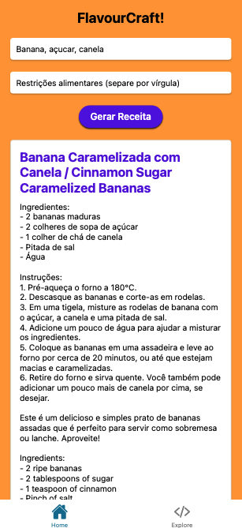

# FlavourCraft!

FlavourCraft is a mobile app created using React Native which offers individualized recipe suggestions depending on the ingredients supplied by the user and their culinary preferences. Using OpenAI's GPT-3.5, the back-end revolves around Node.js and MongoDB for the generation of recipes.


## Features

- Input ingredients and dietary preferences to get personalized recipe recommendations.
- Save generated recipes to MongoDB.
- Clean and easy to use.


## Technologies Used

### Frontend

- React Native
- Expo
- Axios (for API requests)

### Backend

- Node.js
- Express
- MongoDB
- OpenAI GPT-3.5 API
## Getting Started

### Prerequisites

- Node.js and npm installed on your machine.
- MongoDB instance (local or cloud-based).
- Expo CLI for running the React Native app.
- OpenAI API key.

### Installation

1. **Clone the repository**

```bash
git clone https://github.com/LucasPS0/flavourcraft.git
cd flavourcraft

```
2. **Backend Setup**

Navigate to the backend directory.
```bash
cd backend
```
Create a .env file in the backend directory and add your MongoDB URI and OpenAI API key.
```javascript
MONGO_URI=your_mongodb_uri
CHATGPT_API_KEY=your_openai_api_key
PORT=5000
````
Install the backend dependencies.
```bash
npm install
````
Start the backend server.
```bash
node app.js
````
2. **Frontend Setup**

Navigate to the Frontend directory.
```bash
cd RecipeApp
```
Install the frontend dependencies.
```bash
npm install
````
Start the Expo development server.
```bash
npm start
````
**Follow the instructions in the terminal to run the app on an emulator or physical device.**


## Usage/Examples

Run the backend server

Ensure the backend server is running. It should be accessible at http://localhost:5000.

Run the React Native app

Use the Expo CLI to run the app on your preferred device.

Generate Recipes

Open the app.
Enter ingredients and dietary preferences in the input fields.
Press the "Gerar Receita" button.
View the generated recipe.


## API Reference

### Create a Recipe

**Endpoint:** `POST /api/recipes/create`

**Description:** Creates a new recipe using ingredients and dietary preferences provided in the request body.

**Request Body:**
```json
{
  "ingredients": ["ingredient1", "ingredient2"],
  "dietaryPreferences": ["preference1", "preference2"]
}

```
### List All Recipes

**Endpoint:** `GET /api/recipes/list`

**Description:** Retrieves a list of all recipes.

**Response:**
```json
[
  {
    "id": "1",
    "title": "Recipe 1",
    "instructions": "Instructions for recipe 1",
    "ingredients": ["ingredient1", "ingredient2"],
    "dietaryPreferences": ["preference1", "preference2"]
  },
  {
    "id": "2",
    "title": "Recipe 2",
    "instructions": "Instructions for recipe 2",
    "ingredients": ["ingredient3", "ingredient4"],
    "dietaryPreferences": ["preference2", "preference3"]
  }
]

````


## Structure

```bash
flavourcraft/
├── backend/
│   ├── controllers/
│   ├── models/
│   ├── node_modules/
│   ├── routes/
│   ├── services/
│   ├── .env
│   ├── app.js
│   └──package.json
├── frontend/
│   ├── .expo/
│   ├── app/
│   ├── assets/
│   ├── components/
│   ├── constants/
│   ├── hooks/
│   ├── scripts/
│   ├── services/
│   ├── .gitignore
│   ├── app.json
│   ├── babel.config.js
│   ├── expo-env.d.ts
│   ├── package.json
│   ├── README.md
│   └── tsconfig.json
└── README.md
`````

## License

This project is licensed under the MIT License - see the LICENSE file for details.


## Acknowledgements

- OpenAI for the GPT-3.5 API.
- React Native for the mobile app framework.
- MongoDB for the database solution.
- Expo for the development tools.


**Feel free to contribute to the project by submitting issues or pull requests.**
## Screenshots


